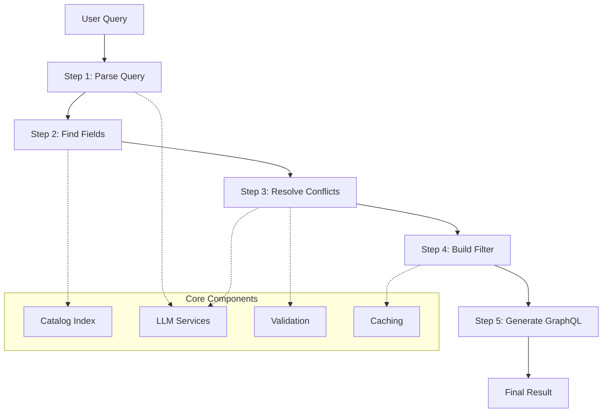

# PCDC Chatbot Backend - Clean Modular Architecture

## Overview

This document summarizes the refactored PCDC Chatbot Backend that implements a clean, modular architecture for converting natural language queries to GraphQL. The system is built around a clear 5-step pipeline with well-defined modules and responsibilities.

## Final Repository Structure

```
src/backend/
├── core/
│   ├── config.py                   # ✅ Configuration management with feature switches
│   ├── models.py                   # ✅ Unified Pydantic data models
│   └── pipeline.py                 # ✅ 5-step pipeline orchestration
├── catalog/
│   ├── loader.py                   # ✅ Catalog loading and parsing
│   ├── index.py                    # ✅ Search indexing and candidate selection
│   └── validator.py                # ✅ Field validation and enum normalization
├── llm/
│   ├── prompts.py                  # 🚧 Prompt template management
│   ├── normalizer.py               # 🚧 Step 2: Term normalization (LLM)
│   └── disambiguator.py            # 🚧 Step 3: Conflict resolution (LLM)
├── graphql/
│   ├── composer.py                 # 🚧 Step 4: Filter composition
│   └── builder.py                  # 🚧 Step 5: GraphQL query generation
├── utils/
│   ├── logging.py                  # ✅ Unified logging with JSON formatting
│   ├── cache.py                    # ✅ LRU caching for performance
│   └── errors.py                   # ✅ Custom exception hierarchy
├── services/
│   └── langfuse_tracker.py         # 📋 Existing - observability tracking
├── tests/
│   ├── unit/                       # 🚧 Unit tests for each module
│   └── e2e/                        # 🚧 End-to-end pipeline tests
├── app_new.py                      # ✅ Clean FastAPI application
└── app.py                          # 📋 Original app (to be replaced)

schema/
└── catalog_v6.json                 # 📋 Main catalog file

tests/                              # 📋 Existing test files (to be reorganized)
```

**Legend:**
- ✅ **Implemented** - Module is complete with full documentation
- 🚧 **Placeholder** - Module structure created, needs implementation
- 📋 **Existing** - Files that exist and should be preserved/reorganized

## Key Architecture Principles

### 1. **Separation of Concerns**
Each module has a single, well-defined responsibility:
- **Core**: Pipeline orchestration and data models
- **Catalog**: Data loading, indexing, and validation
- **LLM**: AI-powered processing steps
- **GraphQL**: Query building and composition
- **Utils**: Cross-cutting concerns (logging, caching, errors)

### 2. **Dependency Injection**
- Global singletons accessed via factory functions (`get_*()`)
- Easy to mock for testing
- Clear dependency relationships

### 3. **Configuration-Driven**
- Feature flags for LLM vs. rule-based processing
- Environment-based configuration
- Easy to switch between development/production modes

### 4. **Error Handling**
- Custom exception hierarchy for different error types
- Structured error responses with trace IDs
- Graceful degradation when components fail

### 5. **Observability**
- Structured JSON logging
- Pipeline step tracking
- Performance metrics
- Cache statistics

## Pipeline Flow



## Configuration Features

### Feature Switches
- `ENABLE_LLM_NORMALIZATION`: Use LLM for query parsing vs. rule-based
- `ENABLE_LLM_DISAMBIGUATION`: Use LLM for conflict resolution vs. simple rules
- `ENABLE_CACHING`: Performance caching system
- `ENABLE_LANGFUSE_TRACKING`: Observability tracking

### Thresholds and Limits
- `KEYWORD_MATCH_THRESHOLD`: Fuzzy matching sensitivity
- `MAX_CANDIDATES_PER_TERM`: Search result limits
- `MIN_TERM_LENGTH`: Minimum term size for processing

## Data Models

All pipeline data is modeled with Pydantic classes:

- **QueryRequest**: API input
- **ParsedQuery**: Step 1 output (terms + logic)
- **FieldMatches**: Step 2 output (candidate fields)
- **ResolvedFields**: Step 3 output (definitive mappings)
- **FilterStructure**: Step 4 output (GraphQL filters)
- **GraphQLQuery**: Step 5 output (final query)
- **PipelineResult**: Complete pipeline output

## Error Handling

Structured exception hierarchy:
- `PCDCChatbotError` (base)
- `ConfigurationError`
- `CatalogError`
- `LLMServiceError`
- `QueryParsingError`
- `FieldMappingError`
- `ConflictResolutionError`
- `FilterBuildingError`
- `QueryGenerationError`

## Caching Strategy

Multi-level caching system:
- **Search Cache**: Query results (5 min TTL)
- **Catalog Cache**: Metadata (1 hour TTL)
- **LLM Cache**: AI responses (30 min TTL)
- **Session Cache**: User sessions (no TTL)

## API Endpoints

### Core Endpoints
- `POST /convert`: Main query conversion endpoint
- `GET /health`: Health check with component status
- `GET /stats`: Application statistics and metrics

### Utility Endpoints
- `POST /cache/clear`: Clear caches and rebuild indices

## Next Steps for Implementation

### Immediate (High Priority)
1. **Complete LLM modules** (`llm/prompts.py`, `llm/normalizer.py`, `llm/disambiguator.py`)
2. **Complete GraphQL modules** (`graphql/composer.py`, `graphql/builder.py`)
3. **Create `__init__.py` files** for all packages
4. **Test basic pipeline flow** with existing catalog

### Short Term
1. **Implement unit tests** for each module
2. **Create integration tests** for full pipeline
3. **Add performance benchmarks**
4. **Create development setup documentation**

### Medium Term
1. **Add more sophisticated LLM prompting**
2. **Implement advanced caching strategies**
3. **Add monitoring and alerting**
4. **Create admin interface for configuration**

## Migration Strategy

1. **Phase 1**: Complete remaining modules and test basic functionality
2. **Phase 2**: Implement comprehensive test suite
3. **Phase 3**: Switch from `app.py` to `app_new.py`
4. **Phase 4**: Remove old code and reorganize tests
5. **Phase 5**: Deploy with monitoring and gradual rollout

## Benefits of New Architecture

### For Development
- **Easier testing**: Each module can be tested independently
- **Clearer debugging**: Structured logging and error handling
- **Faster iteration**: Modular components can be developed in parallel

### For Operations
- **Better monitoring**: Detailed metrics and health checks
- **Easier deployment**: Configuration-driven feature flags
- **Improved reliability**: Graceful degradation and error handling

### For Performance
- **Intelligent caching**: Multi-level cache system
- **Optimized search**: Efficient catalog indexing
- **Reduced LLM calls**: Caching and fallback strategies

This architecture provides a solid foundation for maintaining and extending the PCDC Chatbot Backend while ensuring reliability, performance, and developer productivity. 