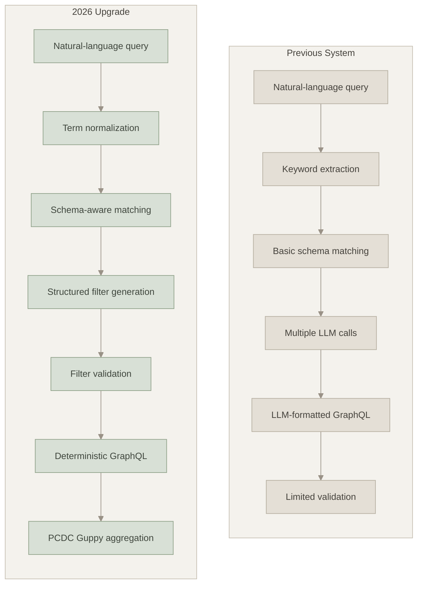
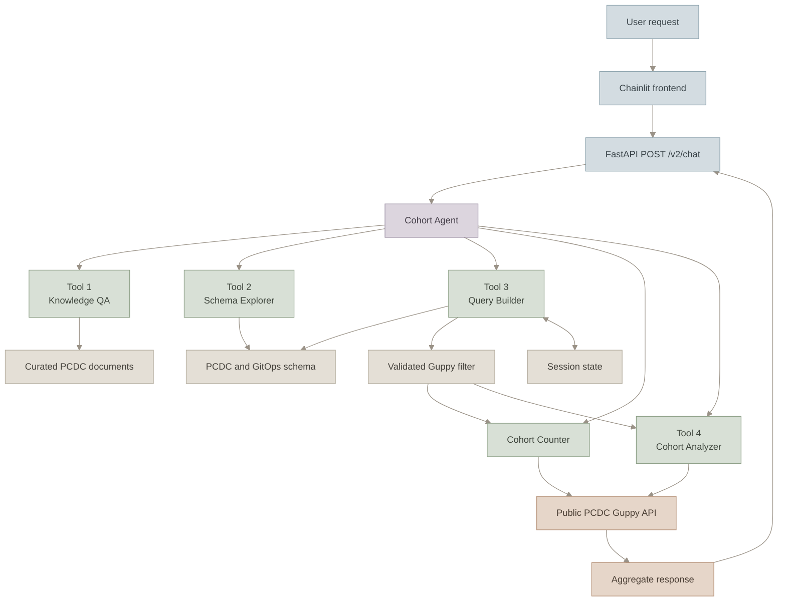
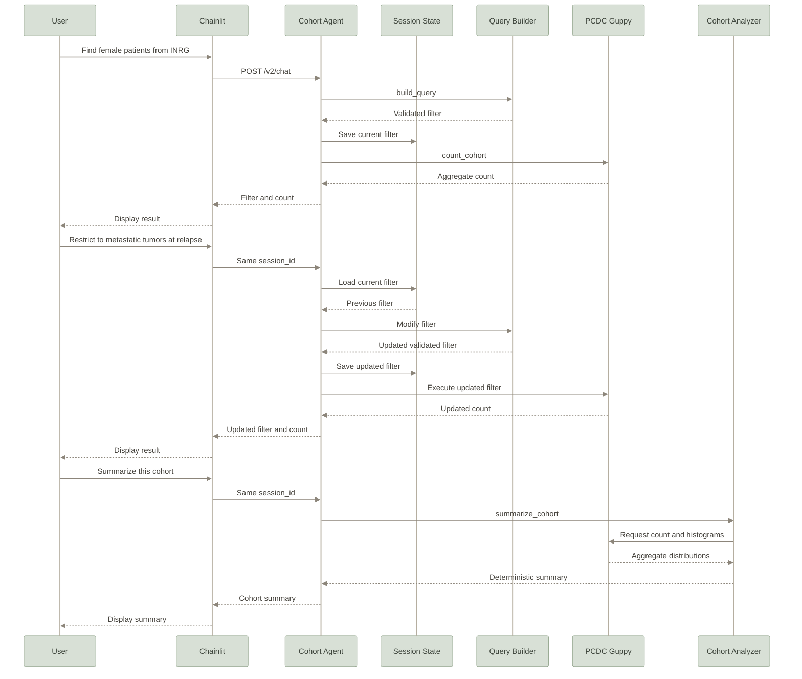
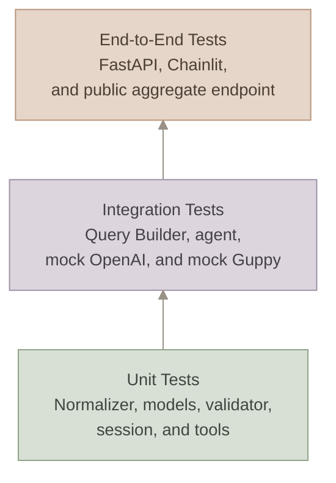
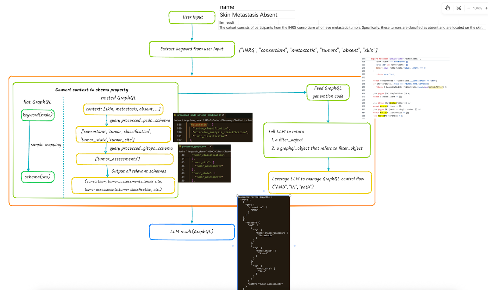
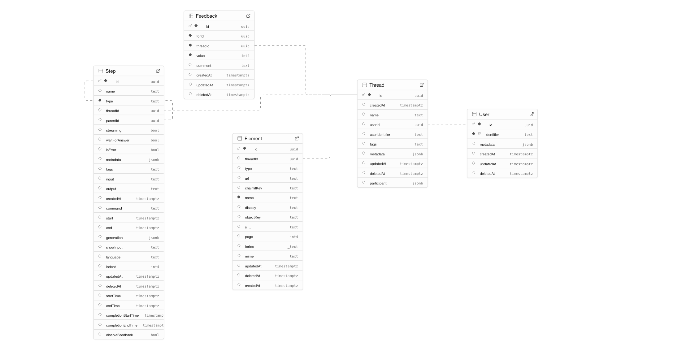

# PCDC Cohort Discovery Chatbot

## Part I: 2026 Upgrade

**Contributor:** YujingDong  
**Email:** dyj02105@gmail.com  
**Mentor:** Jooho Lee

The 2026 upgrade builds on the original natural-language-to-GraphQL prototype and develops it into a schema-aware, validated, multi-tool cohort discovery assistant for the Pediatric Cancer Data Commons (PCDC).

The updated system can:

- answer grounded questions about PCDC and data access;
- explore PCDC fields, nested tables, and valid values;
- convert natural-language cohort requests into validated Guppy filters;
- support top-level, nested, numeric, and logical conditions;
- preserve and modify a cohort across multiple conversation turns;
- execute public PCDC aggregate count queries;
- summarize and compare cohort distributions;
- expose generated filters and execution results through FastAPI and Chainlit.

The assistant only requests aggregate statistics such as `_totalCount` and histograms. It does not request patient-level records.

---

## Evolution from the Previous System

The original project established a natural-language-to-GraphQL workflow. The 2026 upgrade keeps that foundation while separating language interpretation, schema matching, validation, GraphQL construction, data execution, and cohort analysis into independent and testable components.

| Area | Previous System | 2026 Upgrade |
|---|---|---|
| Query generation | Free-text LLM output | Structured Guppy filter generation |
| Term handling | Keyword extraction and exact matching | Phrase, synonym, numeric, and negation handling |
| Schema matching | Basic field lookup | Schema-aware field and nested-path resolution |
| Validation | Limited post-processing | Pydantic and PCDC schema validation |
| GraphQL construction | LLM-formatted output | Deterministic GraphQL rendering |
| Nested filters | Basic nested generation | Path-aware nested filter construction |
| Conversation state | Mostly independent requests | Session-aware cohort refinement |
| Data execution | Separate query workflow | Integrated public Guppy aggregation |
| User capabilities | GraphQL conversion | Multi-tool cohort discovery |
| Frontend integration | Multiple legacy endpoints | Unified `/v2/chat` agent endpoint |



*Figure 1. Evolution from a GraphQL converter to a validated and executable cohort discovery pipeline.*

---

## 2026 System Upgrade

### Schema-Aligned Query Generation

Natural-language clinical terms may appear under multiple fields or nested paths in the PCDC schema. Selecting a value without its schema context can produce a syntactically valid but semantically incorrect filter.

The updated pipeline introduces:

- unified PCDC and GitOps schema loading;
- multi-word phrase recognition;
- schema-derived enum matching;
- curated synonym normalization;
- numeric field and unit resolution;
- schema-aware candidate retrieval;
- nested-path disambiguation;
- structured filter models;
- schema-level filter validation.

As a result, generated filters are checked against real PCDC field names, nested paths, enum values, field types, and supported operators before they are executed.

### Deterministic GraphQL Construction

The previous workflow asked the LLM to help format executable GraphQL. The updated workflow separates semantic interpretation from query rendering:

1. The user request is interpreted as a structured filter.
2. The filter is parsed into a typed model.
3. The filter is validated against the active PCDC schema.
4. Application code builds the GraphQL aggregation query.
5. The validated filter is passed through GraphQL variables.

The final GraphQL structure is therefore deterministic. Natural-language input is never inserted directly into the GraphQL query string.

### Nested and Numeric Conditions

The updated Query Builder supports:

- top-level subject fields;
- fields under nested clinical tables;
- multiple conditions belonging to the same nested record;
- logical `AND` and `OR` structures;
- exclusions and negation;
- numeric operators such as `GT`, `GTE`, `LT`, and `LTE`;
- configured conversion between user units and stored schema units;
- disease-phase conditions associated with the relevant event table.

For example:

```text
Find INRG patients with metastatic tumors at relapse.
```

can produce a top-level consortium condition together with a nested `tumor_assessments` condition.

### Multi-Turn Cohort Refinement

The session layer stores the latest successful filter. A follow-up request can modify that filter instead of rebuilding the complete cohort from scratch.

```text
Find female patients from the INRG consortium.
Restrict the cohort to metastatic tumors at relapse.
Change the consortium to NODAL.
How many subjects are in the current cohort?
```

Existing conditions remain in place unless the user explicitly changes or removes them. A failed request does not overwrite the last successful cohort.

### Public PCDC Guppy Integration

Validated filters can be sent to the public PCDC Guppy GraphQL endpoint:

```text
https://portal.pedscommons.org/guppy/graphql/
```

The count request uses a GraphQL aggregation query:

```graphql
query ($filter: JSON) {
  _aggregation {
    subject(filter: $filter) {
      _totalCount
    }
  }
}
```

The filter is sent through GraphQL variables:

```json
{
  "filter": {
    "AND": [
      {
        "IN": {
          "consortium": ["INRG"]
        }
      }
    ]
  }
}
```

The public aggregate endpoint does not require Gen3 credentials. Live counts may change as PCDC data is updated, so online counts are not hardcoded in the application or regular unit tests.

### Stable API and Frontend Responses

The updated API returns a consistent response containing:

- the assistant reply;
- the generated filter;
- the aggregate count, when available;
- validation and semantic warnings;
- tool execution trace information;
- the session identifier used for later modifications.

Internal failures are logged by the backend and returned to the frontend as sanitized error responses.

---

## Updated Architecture

The upgraded system uses an agent to route each request to a specialized tool.



*Figure 2. Multi-tool agent architecture with shared schema, session, and Guppy infrastructure.*

| Capability | Internal tool | Responsibility |
|---|---|---|
| Knowledge QA | `answer_from_docs` | Answer grounded questions about PCDC, Guppy, access, consortia, and chatbot capabilities |
| Schema Explorer | `explore_schema` | Look up fields, nested tables, enum values, and field descriptions |
| Query Builder | `build_query` | Generate or modify a validated cohort filter |
| Cohort Counter | `count_cohort` | Execute the current filter and return `_totalCount` |
| Cohort Summary | `summarize_cohort` | Summarize the current cohort |
| Cohort Comparison | `compare_cohort` | Compare the current cohort with another cohort |

---

## Current Capabilities

### Tool 1: Knowledge QA

Knowledge QA retrieves relevant passages from a curated local PCDC knowledge base.

Example questions:

```text
What is PCDC?
Which consortia contribute data to PCDC?
Do I need an account to access aggregate data?
What is Guppy?
What can this chatbot do?
```

The tool returns grounded content from the configured documents. When the documentation does not provide sufficient evidence, the tool returns a safe no-match response instead of generating an unsupported answer.

### Tool 2: Schema Explorer

Schema Explorer provides deterministic access to the local PCDC schema.

Supported operations include:

- listing top-level subject fields;
- listing fields under a nested table;
- listing nested tables;
- showing valid enum values;
- describing a field;
- finding which fields contain a particular value.

Example questions:

```text
What fields are available under tumor_assessments?
What values does tumor_classification allow?
Describe age_at_tumor_assessment.
Which field contains the value Metastatic?
List the nested tables under subject.
```

### Tool 3: Query Builder

Query Builder converts natural-language cohort descriptions into validated Guppy filters.

It supports:

- new cohort requests;
- top-level and nested conditions;
- numeric ranges and unit conversion;
- logical `AND` and `OR` structures;
- exclusions and negation;
- session-aware modifications;
- deterministic GraphQL construction.

Example requests:

```text
Find female patients from the INRG consortium.
Show subjects with metastatic tumors at relapse.
Include only patients younger than five years at tumor assessment.
Change the consortium from INRG to NODAL.
Remove the sex condition.
```

A generated filter may look like:

```json
{
  "AND": [
    {
      "IN": {
        "consortium": ["INRG"]
      }
    },
    {
      "IN": {
        "sex": ["Female"]
      }
    },
    {
      "nested": {
        "path": "tumor_assessments",
        "AND": [
          {
            "IN": {
              "disease_phase": ["Relapse"]
            }
          },
          {
            "IN": {
              "tumor_classification": ["Metastatic"]
            }
          }
        ]
      }
    }
  ]
}
```

### Cohort Counter

The Cohort Counter executes the latest successful filter against the configured Guppy endpoint.

Example:

```text
How many subjects are in the current cohort?
```

The public PCDC endpoint may return `-1` when a result is suppressed by a privacy rule. In that case, `-1` does not mean zero and does not mean the request failed.

### Tool 4: Cohort Analyzer

Tool 4 uses deterministic calculations and formatting. It does not ask an LLM to calculate or invent statistical values.

The current summary includes:

- total subject count;
- sex distribution;
- race distribution;
- ethnicity distribution;
- consortium distribution.

Example requests:

```text
Summarize the current cohort.
Describe the make-up of this cohort.
Compare this cohort with NODAL patients.
How does the current cohort differ from the equivalent NODAL cohort?
```

In compare mode, the current filter becomes cohort A. The comparison request is processed through the Query Builder to create cohort B. The analyzer then aligns category buckets and calculates percentage differences.

---

## Schema-Aligned Query Pipeline

Tool 3 uses a staged pipeline so that language interpretation, schema validation, and query execution remain separate.


*Figure 3. Schema-aligned natural-language-to-Guppy pipeline.*

| Stage | Type | Responsibility |
|---|---|---|
| Term normalization | Deterministic | Recognize phrases, aliases, values, and schema placements |
| Numeric resolution | Deterministic | Bind numeric expressions to configured fields and schema units |
| Candidate retrieval | Deterministic or embedding-assisted | Reduce schema context to relevant candidates |
| Filter generation | LLM-assisted | Interpret the requested cohort conditions and logical structure |
| Filter model | Deterministic | Enforce the supported filter structure |
| Schema validation | Deterministic | Check fields, paths, values, operators, and types |
| GraphQL rendering | Deterministic | Build the aggregation query and variables |
| Guppy execution | External | Return real PCDC aggregate results |
| Cohort formatting | Deterministic | Format counts, distributions, and comparisons |

The LLM helps interpret the request, but it does not generate returned counts, bypass schema validation, or directly insert user input into the final GraphQL query.

---

## Quick Start

Dependency installation commands are run from the repository root. Backend startup runs from `src/backend`, and frontend startup runs from `src/frontend`.

### 1. Backend Environment

```bash
python3 -m venv backend_env
source backend_env/bin/activate
python -m pip install --upgrade pip
pip install -r backend_requirements.txt
```

### 2. Minimal Configuration

Create a `.env` file in the repository root:

```dotenv
OPENAI_API_KEY=your_openai_api_key
GUPPY_ENDPOINT=https://portal.pedscommons.org/guppy/graphql/
CHAINLIT_AUTH_SECRET=your_random_secret
```

`OPENAI_API_KEY` enables the model-driven agent and filter generation. `GUPPY_ENDPOINT` enables real cohort counting and cohort analysis.

The public production Guppy endpoint supports aggregate queries without Gen3 credentials.

If you do not use a `.env` file, export the required backend variables in the same terminal before starting the backend:

```bash
export OPENAI_API_KEY="your_openai_api_key"
export GUPPY_ENDPOINT="https://portal.pedscommons.org/guppy/graphql/"
```

Use the development endpoint only when you specifically need the PCDC development environment:

```bash
export GUPPY_ENDPOINT="https://portal-dev.pedscommons.org/guppy/graphql"
```

After adding or changing these variables, restart the backend so the agent is initialized with the updated configuration.


<details>
<summary>Optional configuration</summary>

| Variable | Default | Purpose |
|---|---|---|
| `AGENT_CHAT_MODEL` | `gpt-4o-mini` | OpenAI model used by the agent |
| `GUPPY_USE_CREDENTIALS` | Disabled | Enable Gen3 credentials for restricted environments |
| `BACKEND_URL` | `http://localhost:8000` | Backend URL used by Chainlit |
| `BACKEND_TIMEOUT` | `120` | Frontend request timeout in seconds |
| `SCHEMA_DIR` | Repository `schema` directory | Override the schema directory |
| `PCDC_SCHEMA_PATH` | Newest local production schema | Override the PCDC schema file |
| `GITOPS_PATH` | Local `gitops.json` | Override the GitOps schema file |
| `AGENT_CACHE_DIR` | None | Store reusable schema embedding data |

</details>

### 3. Start the Backend

Working directory: `src/backend`

```bash
python -m uvicorn app:app --host 127.0.0.1 --port 8000
```

Backend URL:

```text
http://127.0.0.1:8000
```

FastAPI documentation:

```text
http://127.0.0.1:8000/docs
```

### 4. Frontend Environment

Create the frontend environment from the repository root:

```bash
python3 -m venv frontend_env
source frontend_env/bin/activate
python -m pip install --upgrade pip
pip install -r frontend_requirements.txt
```
### 5. Start the Frontend

Working directory: `src/frontend`

```bash
chainlit run chainlit_app.py -w --port 8082
```

Frontend URL:

```text
http://127.0.0.1:8082
```

Local demonstration login:

```text
Username: test
Password: test
```

### 6. Call the API Directly

Create and count a cohort:

```bash
curl --max-time 180 \
  -X POST http://127.0.0.1:8000/v2/chat \
  -H "Content-Type: application/json" \
  -d '{
    "session_id": "demo-session",
    "message": "Find female patients from the INRG consortium."
  }'
```

Modify the same cohort by reusing `session_id`:

```bash
curl --max-time 180 \
  -X POST http://127.0.0.1:8000/v2/chat \
  -H "Content-Type: application/json" \
  -d '{
    "session_id": "demo-session",
    "message": "Restrict the cohort to metastatic tumors at relapse."
  }'
```

Count the current cohort:

```bash
curl --max-time 180 \
  -X POST http://127.0.0.1:8000/v2/chat \
  -H "Content-Type: application/json" \
  -d '{
    "session_id": "demo-session",
    "message": "How many subjects are in the current cohort?"
  }'
```

The response contains the current session, assistant reply, generated filter, count, warnings, and tool trace:

```json
{
  "session_id": "demo-session",
  "reply": "The current cohort contains 12,345 subjects.",
  "filter": {
    "AND": [
      {
        "IN": {
          "consortium": ["INRG"]
        }
      }
    ]
  },
  "count": 12345,
  "histograms": null,
  "warnings": [],
  "stopped": false,
  "trace": [
    {
      "tool": "build_query",
      "ok": true
    },
    {
      "tool": "count_cohort",
      "ok": true,
      "detail": "count=12345"
    }
  ]
}
```

The count above is illustrative. Actual counts depend on the current PCDC data.

---

## End-to-End Demo

The following sequence demonstrates Tool 3 query construction, session-aware modification, Guppy execution, and Tool 4 analysis.



*Figure 4. End-to-end multi-turn cohort discovery workflow.*

### Suggested Demonstration Conversation

```text
1. Find female patients from the INRG consortium.

2. Restrict the cohort to patients with metastatic tumors at relapse.

3. How many subjects are in the current cohort?

4. Summarize the current cohort.

5. Compare it with the equivalent NODAL cohort.

6. What values does tumor_classification allow?

7. What is PCDC?
```

This sequence demonstrates:

- top-level filter generation;
- nested clinical conditions;
- multi-turn filter preservation;
- real aggregate counting;
- deterministic cohort summaries;
- cohort comparison;
- schema exploration;
- documentation-grounded QA.

---

## Testing and Evaluation

The updated backend separates deterministic services from external dependencies so most behavior can be tested offline.



*Figure 5. Testing layers for the upgraded system.*

### Test Coverage

The upgraded pipeline includes tests for:

- filter models;
- schema loading and field placement;
- term and synonym normalization;
- numeric field resolution and unit conversion;
- candidate retrieval;
- nested-path narrowing;
- structured filter generation;
- schema validation;
- deterministic GraphQL rendering;
- session-aware query modification;
- agent function-call parsing and dispatch;
- Knowledge QA grounding;
- Schema Explorer operations;
- Guppy response parsing and errors;
- cohort summarization and comparison;
- frontend-compatible API responses.

### Run the Test Suite

```bash
PYTHONPATH=src/backend pytest -q src/tests
```

Some legacy infrastructure tests may require separately configured services such as PostgreSQL.

### Public PCDC Integration Test

The public integration test is disabled during ordinary test runs so that regular tests do not depend on network access.

Run it explicitly with:

```bash
RUN_PCDC_GUPPY_INTEGRATION=1 \
PYTHONPATH=src/backend \
pytest -q src/tests/test_pcdc_guppy_integration.py
```

This test performs a read-only aggregation request and verifies that PCDC returns an integer subject count. It does not request patient-level data and does not hardcode the current online count.

### Evaluation Data

The repository includes Amanuensis-derived cohort search data for evaluating generated filters against reference filters.

Evaluation focuses on:

| Metric | Meaning |
|---|---|
| Exact match | The generated filter matches the reference filter |
| Field accuracy | Correct PCDC fields are selected |
| Value accuracy | Correct enum or numeric values are selected |
| Structure accuracy | Logical and nested structures are correct |
| Execution equivalence | Generated and reference filters return equivalent aggregate results |
| Latency | End-to-end processing time |
| Failure analysis | Errors grouped by field, value, path, operator, or structure |

The evaluation data supports reproducible regression testing as schema handling, prompt design, and synonym coverage evolve.


**Contributor**: **Regina Huang**

**Email:** huang.rong@northeastern.edu

**Github profile**: https://github.com/RongHuang14

**LinkedIn**: https://www.linkedin.com/in/ronghuang14/

**Mentor:** **Jooho Lee**

## About
**GraphQL Convertor** is a GraphQL generation agent application built with Chainlit and FastAPI that converts natural language queries into GraphQL queries.

**Overview:**
This project is a GraphQL generation agent that converts human language queries into GraphQL queries using AI. Below is the project workflow and code structure:



```
├── README.md  
├── frontend_requirements.txt                  
├── backend_requirements.txt
├── .env                        # OpenAI key & postgresql url
│
├── src/    
│   ├── frontend/                
│   │   ├── chainlit_app.py     # Main Chainlit application
│   │   ├── chainlit.md         # Welcome page
│   │   └── run.sh              # Frontend startup script
│   │
│   ├── backend/                 
│   │   ├── app.py              # Main FastAPI application
│   │   ├── start.sh            # Backend startup script
│   │   ├── interactive_demo.sh 
│   │   └── utils/
│   │       ├── nested_graphql_helper.py  # utils for generating nested graphql
│   │       ├── prompt_builder.py    
│   │       ├── filter_utils.py      
│   │       ├── credential_helper.py  # Generate token for guppy/graphql API
│   │       ├── schema_parser.py    
│   │       ├── query_builder.py     
│   │       └── context_manager.py       
│   │
│   └── tests/                   
│       ├── test_db.py          
│       ├── test_queries.py     
│       ├── test_filter_utils.py 
│       ├── validate_graphql_generation.py
│       └── test_setup.py       
│
├── schema/                      
│   ├── gitops.json             # GraphQL schema content
│   ├── pcdc-schema-prod-*.json 
│   └── subject.json            
│
├── assets/                     
```

## Getting Started
### 1. Installation
1. After cloning the project, install dependencies:  
You need to build frontend env and backend env seperately, because ```gen3``` and ```chainlit``` have version conflict on ```aiofiles```.  

Build frontend venv
```bash
python3 -m venv frontend_env
source frontend_env/bin/activate
pip install --upgrade pip
pip install -r frontend_requirements.txt
```
Build backend venv
```bash
python3 -m venv backend_env
source backend_env/bin/activate
pip install --upgrade pip
pip install -r backend_requirements.txt
```

2. Set up your OpenAI API key in the `.env` file:
```
OPENAI_API_KEY=your_api_key_here
DATABASE_URL=postgresql://postgres:your_postgresql_address
```

### 2. Run the Application Backend
First, make sure you start the backend server in ```backend_env```:
```bash
source backend_env/bin/activate
cd src/backend/
python -m uvicorn app:app --reload
```
The backend API will run at http://localhost:8000

#### Backend API Usage
```bash
cd src/backend/
```
##### 1. Convert user input to flat GraphQL:
```bash
curl -X POST "http://localhost:8000/flat_graphql" \
     -H "Content-Type: application/json" \
     -d '{"text": "I want to query all male patients"}'
```
##### Example Response
```json
{
    "query": "query ($filter: JSON) { _aggregation { subject(accessibility: all, filter: $filter) { consortium { histogram { key count } } race { histogram { key count } } _totalCount } } }",
    "variables": "{'AND': [{'IN': {'race': ['Asian']}}]}"
}
```
##### 2. Convert user input to nested GraphQL:
```bash
curl -X POST "http://localhost:8000/nested_graphql" \
     -H "Content-Type: application/json" \
     -d '{"text": "The cohort consists of participants from the INRG consortium who have metastatic tumors. Specifically, these tumors are classified as absent and are located on the skin."}'
```
##### Example Response
```json
{
  "AND": [
    {
      "IN": {
        "consortium": [
          "INRG"
        ]
      }
    },
    {
      "nested": {
        "AND": [
          {
            "IN": {
              "tumor_classification": [
                "Metastatic"
              ]
            }
          },
          {
            "IN": {
              "tumor_state": [
                "Absent"
              ]
            }
          },
          {
            "IN": {
              "tumor_site": [
                "Skin"
              ]
            }
          }
        ],
        "path": "tumor_assessments"
      }
    }
  ]
}
```
##### 2. Get query GraphQL result:
##### Flat GraphQL Example 
```bash
curl -X POST http://localhost:8000/query \
  -H "Content-Type: application/json" \
  -d '{
    "query": "query ($filter: JSON) { _aggregation { subject(accessibility: all, filter: $filter) { consortium { histogram { key count } } sex { histogram { key count } } _totalCount } } }",
    "variables": {"filter": {"AND": [{"IN": {"sex": ["Male"]}}]}}
  }'
```
##### Example Response
```json
{"data":{"_aggregation":{"subject":{"consortium":{"histogram":[{"key":"INSTRuCT","count":52},{"key":"NODAL","count":44},{"key":"INRG","count":42},{"key":"INTERACT","count":38},{"key":"HIBISCUS","count":37},{"key":"MaGIC","count":33},{"key":"ALL","count":32}]},"sex":{"histogram":[{"key":"Other","count":60},{"key":"Male","count":48},{"key":"Undifferentiated","count":45},{"key":"Female","count":43},{"key":"Unknown","count":35},{"key":"Not Reported","count":31},{"key":"no data","count":57}]},"_totalCount":319}}}}
```
##### Nested GraphQL Example (aggregation format)
```bash
curl -X POST http://localhost:8000/query \
  -H "Content-Type: application/json" \
  -d '{
  "query": "query GetAggregation($filter: JSON) { _aggregation { subject(accessibility: all, filter: $filter) { _totalCount } } }",
  "variables": {
    "filter": {
      "AND": [
        {
          "IN": {
            "consortium": [
              "INRG"
            ]
          }
        },
        {
          "nested": {
            "path": "tumor_assessments",
            "AND": [
              {
                "IN": {
                  "tumor_classification": [
                    "Metastatic"
                  ]
                }
              },
              {
                "IN": {
                  "tumor_state": [
                    "Absent"
                  ]
                }
              },
              {
                "IN": {
                  "tumor_site": [
                    "Skin"
                  ]
                }
              }
            ]
          }
        }
      ]
    }
  }
}'
```
##### Example Response (via https://portal.pedscommons.org/query)
```json
{
  "data": {
    "_aggregation": {
      "subject": {
        "_totalCount": 8508
      }
    }
  }
}
```
### 3. Run the Application Frontend
First, make sure you start the frontend server in ```frontend_env```:
```bash
source frontend_env/bin/activate
bash src/frontend/run.sh
```
It will run at http://localhost:8082

To login, you can use any of follwing accounts:
    username: test password: test
    username: admin password: admin
    username: user password: user123

### 4. Postgresql db schema

```
create table public."Element" (
  id uuid not null default extensions.uuid_generate_v4 (),
  "threadId" uuid null,
  type text null,
  url text null,
  "chainlitKey" text null,
  name text not null,
  display text null,
  "objectKey" text null,
  size text null,
  page integer null,
  "forIds" text[] null,
  mime text null,
  "updatedAt" timestamp with time zone null default CURRENT_TIMESTAMP,
  "deletedAt" timestamp with time zone null,
  "createdAt" timestamp with time zone null default CURRENT_TIMESTAMP,
  constraint Element_pkey primary key (id),
  constraint Element_threadId_fkey foreign KEY ("threadId") references "Thread" (id) on delete CASCADE
) TABLESPACE pg_default;

create index IF not exists idx_element_threadid on public."Element" using btree ("threadId") TABLESPACE pg_default;
```
```
create table public."Feedback" (
  id uuid not null default extensions.uuid_generate_v4 (),
  "forId" uuid not null,
  "threadId" uuid not null,
  value integer not null,
  comment text null,
  "createdAt" timestamp with time zone null default CURRENT_TIMESTAMP,
  "updatedAt" timestamp with time zone null default CURRENT_TIMESTAMP,
  "deletedAt" timestamp with time zone null,
  constraint Feedback_pkey primary key (id),
  constraint Feedback_threadId_fkey foreign KEY ("threadId") references "Thread" (id) on delete CASCADE
) TABLESPACE pg_default;

create index IF not exists idx_feedback_threadid on public."Feedback" using btree ("threadId") TABLESPACE pg_default;

create index IF not exists idx_feedback_forid on public."Feedback" using btree ("forId") TABLESPACE pg_default;
```
```
create table public."Step" (
  id uuid not null default extensions.uuid_generate_v4 (),
  name text null default 'step'::text,
  type text not null,
  "threadId" uuid null,
  "parentId" uuid null,
  streaming boolean null default false,
  "waitForAnswer" boolean null default false,
  "isError" boolean null default false,
  metadata jsonb null default '{}'::jsonb,
  tags text[] null,
  input text null,
  output text null,
  "createdAt" timestamp with time zone null default CURRENT_TIMESTAMP,
  command text null,
  start timestamp with time zone null,
  "end" timestamp with time zone null,
  generation jsonb null,
  "showInput" text null,
  language text null,
  indent integer null default 0,
  "updatedAt" timestamp with time zone null default CURRENT_TIMESTAMP,
  "deletedAt" timestamp with time zone null,
  "startTime" timestamp with time zone null,
  "endTime" timestamp with time zone null,
  "completionStartTime" timestamp with time zone null,
  "completionEndTime" timestamp with time zone null,
  "disableFeedback" boolean null default false,
  constraint Step_pkey primary key (id),
  constraint Step_parentId_fkey foreign KEY ("parentId") references "Step" (id) on delete CASCADE,
  constraint Step_threadId_fkey foreign KEY ("threadId") references "Thread" (id) on delete CASCADE
) TABLESPACE pg_default;

create index IF not exists idx_step_threadid on public."Step" using btree ("threadId") TABLESPACE pg_default;

create index IF not exists idx_step_parentid on public."Step" using btree ("parentId") TABLESPACE pg_default;

create index IF not exists idx_step_createdat on public."Step" using btree ("createdAt" desc) TABLESPACE pg_default;
```
```
create table public."User" (
  id uuid not null default extensions.uuid_generate_v4 (),
  identifier text not null,
  metadata jsonb null default '{}'::jsonb,
  "createdAt" timestamp with time zone null default CURRENT_TIMESTAMP,
  "updatedAt" timestamp with time zone null default CURRENT_TIMESTAMP,
  "deletedAt" timestamp with time zone null,
  constraint User_pkey primary key (id),
  constraint User_identifier_key unique (identifier)
) TABLESPACE pg_default;

create index IF not exists idx_user_identifier on public."User" using btree (identifier) TABLESPACE pg_default;
```
```
create table public."Thread" (
  id uuid not null default extensions.uuid_generate_v4 (),
  "createdAt" timestamp with time zone null default CURRENT_TIMESTAMP,
  name text null,
  "userId" uuid null,
  "userIdentifier" text null,
  tags text[] null,
  metadata jsonb null default '{}'::jsonb,
  "updatedAt" timestamp with time zone null default CURRENT_TIMESTAMP,
  "deletedAt" timestamp with time zone null,
  participant jsonb null,
  constraint Thread_pkey primary key (id),
  constraint Thread_userId_fkey foreign KEY ("userId") references "User" (id) on delete CASCADE
) TABLESPACE pg_default;

create index IF not exists idx_thread_userid on public."Thread" using btree ("userId") TABLESPACE pg_default;

create index IF not exists idx_thread_useridentifier on public."Thread" using btree ("userIdentifier") TABLESPACE pg_default;

create index IF not exists idx_thread_createdat on public."Thread" using btree ("createdAt" desc) TABLESPACE pg_default;
```
### 5. Future work
#### 5.1 Support disease_phase field in nested graphql (Todo)
```sql
{"query":"query ($filter: JSON) { _aggregation { subject (filter: $filter, accessibility: all) { sex { histogram { key count } } race { histogram { key count } } ethnicity { histogram { key count } } consortium { histogram { key count } } } } }","variables":{"filter":{"AND":[{"nested":{"path":"tumor_assessments","AND":[{"AND":[{"IN":{"disease_phase":["Initial Diagnosis"]}},{"AND":[{"IN":{"tumor_classification":["Metastatic"]}},{"IN":{"tumor_site":["Bone"]}}]}]}]}}]}}}
```
#### 5.2 Support number field(GTE, LTE) in nested graphql (Todo)
```sql
{
  "filter_main": {
    "AND": [
      {
        "nested": {
          "path": "tumor_assessments",
          "AND": [
            {
              "AND": [
                {
                  "GTE": {
                    "age_at_tumor_assessment": 0
                  }
                },
                {
                  "LTE": {
                    "age_at_tumor_assessment": 100
                  }
                }
              ]
            }
          ]
        }
      }
    ]
  }
}
```
